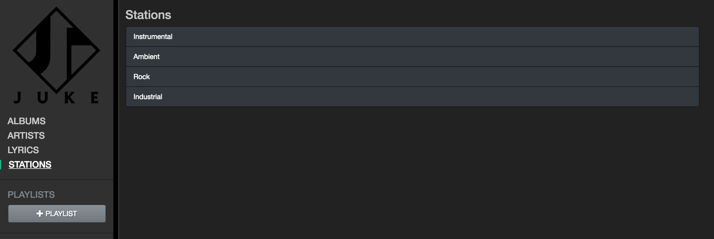
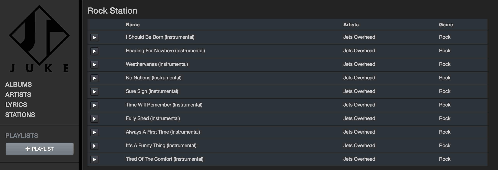
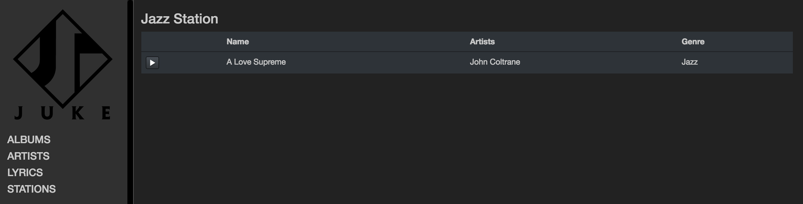
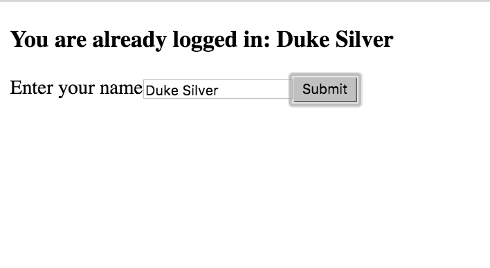
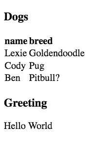
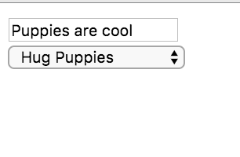
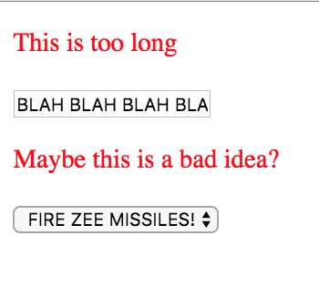

# React V

## Intro

### Preparación

Estamos muy cerca de la perfección! En este punto, `redux` ha considerablemente simplificado nuestra habilidad de manejar estado ofreciendo una sola fuente de verdad para toda nuestra app y una amigable API para `dispatch`ear cambios a esa fuente de verdad.

Sin embargo, hay todavía algunas molestias persistentes, principalmente de los contenedores que escribimos. Por ejemplo, necesitar usar `store.subscribe` y `this.unsubscribe` todo el tiempo. También hemos escrito `import store from '../store` tantas veces que mis dedos se estan hinchando.

Hay una pequeña librería extremadamente útil llamada [`react-redux`](https://github.com/reactjs/react-redux) que nos va a ayudar a limpiar considerablemente nuestro código! Y cuando digo pequeña, realmente significa **pequeña**. Es realmente solo **una función**, una función llamada `connect`! Sin embargo, la función `connect` nos va a ayudar a escribir código increible.


### Ejemplo: Hagamoslo Nosotros Mismo

Como Dan Abramov (el creador de `redux`) ha dicho multiples veces, la librería `redux` no tiene nada que ver con `react`. Podríamos usarla donde quisieramos, la podríamos usar para simplificar aplicación web con estado construidas con librerías como `angular` o incluso `jQuery`.

Pero como ya sabemos que queremos usar `react`, usemos una librería que nos ayude como `react-redux` para simplificar la forma que nuestros componentes se comunican con el store de `redux`.

Ahora mismo nuestros "contenedores" tienen los siguientes **4 trabajos**:

**Trabajo 1.** Subscribir el store de redux cuando el componente se monta.

**Trabajo 2.** Tomar el estado del store, y enviar las partes que nos impñorten como props a nuestros componentes presentacionales.

**Trabajo 3.** Definí métodos que dispatchen cambios al store.

**Trabajo 4.** Desuscribirse de el store de redux cuando el componente se desmonta.

La librería `react-redux` nos da un método llamado `connect` el cual **simplifica la forma que hacemos estos 4 trabajos**. Para aprender como usarlo, hagamos una de mis cosas favoritas - **escribirlo nosotros mismos!**

Por ejemplo, pretendamos que tenemos el siguiente contenedor:

##### Ejemplo 1

```JSX
import React from 'react';
import store from '../store';
import { incrementCounter } from '../action-creators';
import StatelessComponent from './StatelessComponent';

class ContainerComponent extends React.Component {
  constructor (props) {
    super(props);
    this.state = store.getState();
  }

  // Trabajo 1: subscribirse al store
  componentDidMount () {
    this.unsubscribe = store.subscribe(() => this.setState(store.getState()));
  }

  // Trabajo 4: desuscribirse cuando se desmonta
  componentWillUnmount () {
    this.unsubscribe();
  }

  // Trabajo 3: define métodos que dispatchean al store
  increment () {
    store.dispatch(incrementCounter());
  }

  render () {
    // Trabajo 2: "mapea" data del estado a los props
    const {counter} = this.state;
    return <StatelessComponent counter={counter} increment={this.increment} />
  }
}
``` 

Eso es bastante de boilerplate. Especialmente el `componentDidMount`y `componentWillUnmount` hooks. Cada componente contenedor que escribimos va a necesitar el mismo código! No suena muy DRY si me lo preguntas.

Podemos resolver esto nosotros mismos escribiendo una **función** que retorne un **Componente de React** Para que maneje ese boilerplate. Así es como se puede ver:

##### Ejemplo 2a

```JSX
import React from 'react';
import store from '../store';

// Esta función toma un componente de React como argumento...
function createSubscribedComponent (OtherReactComponent) {
  // ...ay retorna un nuevo componente, genial!
  return class extends React.Component {
    constructor (props) {
      super(props);
      this.state = store.getState();
    }

    // Trabajo 1: se subscribe al store
    componentDidMount () {
      this.unsubscribe = store.subscribe(() => this.setState(store.getState()));
    }

    // Trabajo 4: se desuscribe cuando se monta 
    componentWillUnmount () {
      this.unsubscribe();
    }

    render () {
      return <OtherReactComponent passedDownState={this.state} />
    }
  }
}
```

##### Ejemplo 2b

```JSX
// Ahora, el trabajo 1 y el 4 es completamente manejado para nosotros! 
// Esto significa que solo necesitamos escribir un componente que realice el trabajo 2 y 3!
import React from 'react';
import store from '../store';
import { incrementCounter } from '../action-creators';

class ContainerComponent extends React.Component {

  // Trabajo 3: define métodos que dispatchean al store
  increment () {
    store.dispatch(incrementCounter());
  }

  render () {
    // Trabajo  2: "mapea" data del estado a los props
    const { counter } = this.props.passedDownState;
    return <StatelessComponent counter={counter} increment={this.increment} />
  }
}
```

##### Ejemplo 2c

```js
// Ahora, podemos crear componentes arbitrarios que se subscriban y desusucriban del store.
// De esta manera:

const SubscribedComponent = createSubscribedComponent(ContainerComponent);
```

Genial, entonces ahora tenemos una función que va a atuomatizar todo el boilerplate de `componentDidMount` y `componentWillUnmount`, por lo que nos podemos enfocar en escribir componentes que mapean nuestro estado y mapea funciones que usan dispatch.

ESto es genial... pero podemos hacerlo aún mejor! Realmente necesitamos escribir componentes extra para mapear nuestro estado y métodos? No lo necesitamos! En cambio, podemos escribir **funciones** que hagan el trabajo 2 y 3 por nosotros, y luego le enseñen al `SubscribedComponent` como invocarlos.

Aquí es cuando se vuelve más difícil, pero no te preocupes - vas a necesitar volver a este punto y releer un par de veces hasta que hagas el click, y eso esta bien! Aquí vamos:

Queremos tener la habilidad de hacer el trabajo 2 y 3 a el componente que `createSubscribedComponent` retorna. Podemos hacer esto envolviendo `createSubscribedComponent` en otra función. Esta es la función a la que vamos a llamar `connect`.

`connect` es una función que retorna una función (a.k.a "higher-order function"). Retorna nuestra función `createSubscribedComponent` de antes (con un par de cambios). `connect`toma dos argumentos, "mapStateToProps" (función que hace el trabajo 2), y "mapDispatchToProps" (función que hace el trabajo 3). Vamos a escribir estas funciones nosotros mismos cada vez que tenemos un nuevo componente que crear. Vamos a escribirlos para nuestro ejemplo en un momento pero ahora asumamos lo siguiente:

- `mapStateToProps` toma el estado del store de redux como argumento, y retorna un objeto con solo los props que queremos pasar como un objeto.
- `mapDispatchToProps` toma el `dispatch` del store de redux como un argumento, y retorna un objeto con todos los metodos específicos que queremos en un objeto.


##### Ejemplo 3a

```JSX
import React from 'react';
import store from '../store';

function connect (mapStateToProps, mapDispatchToProps) {
  // createSubscribedComponent va a tener mapStateToProps and mapDispatchToProps
  return function createSubscribedComponent (OtherReactComponent) {
    return class extends React.Component {
      constructor (props) {
        super(props);
        this.state = store.getState();
      }

      // Trabajo 1: suscribirse al store
      componentDidMount () {
        this.unsubscribe = store.subscribe(() => this.setState(store.getState()));
      }

      // Trabajo 4: desuscribirse al store
      componentWillUnmount () {
        this.unsubscribe();
      }

      render () {
        // Trabajo 2: `ourProps` es un objeto que se vé asi: 
        // { counter: state.counter }
        const ourProps = mapStateToProps(store.getState());

        // Trabajo 3: `ourMethods` es un objeto que se ve así: 
        // { increment: function () { dispatch(incrementCounter()) } }
        const ourMethods = mapDispatchToProps(store.dispatch)

        // todos nuestros props y métodos son pasados para abajo a OtherReactComponent!
        return <OtherReactComponent {...ourProps} {...ourMethods} />
      }
    }
  }
}
```

Con lo de arriba en mente, aquí esta como podríamos escribir las funciones `mapStateToProps` y `mapDispatchToProps`.

##### Ejemplo 3b

```js
import React from 'react';
import { incrementCounter } from '../action-creators';

// espera recibir el estado actual como un argumento
// retorna un objeto con solo los campos del estado que nos importan
function mapStateToProps (state) {
  return {
    counter: state.counter
  };
}

// espera recibir el método de dispatch como un argumento
// retorna un objeto con los métodos que queremos usar
function mapDispatchToProps (dispatch) {
  return {
    increment: function () {
      dispatch(incrementCounter());
    }
  };
}
```

Ahora, si ponemos todo junto, no neceistamos escribir nuestras propias clases `React.Component` que se subscriben y desuscriben del estado o pasan props y métodos. Lo único que necesitamos escribir esas dos funciones de arriba!

##### Ejemplo 3c

```js
// Le pasamos las dos funciones que escribimos arriba a "connect" y la invocamos,
// lo cual nos da nuestra función "createSubscribedComponent", el cual ahora tiene closure sobre las
// dos funciones, e invocamos eso con nuestro componente objetivo!
const CompletedCounterComponent = connect(
  mapStateToProps, mapDispatchToProps)(StatelessComponent);
// Podemos pasar nuestro StatelessComponent para que reciva las props que necesita! 
// No hay necesidad de escribir una nueva clase!
```

Ahora, **cada vez** que queremos un componente que fue conectado al store de redux, no necesitamos escribir una clase - solo necesitamos escribir un par de funciones! Compara eso con todo lo que tuvimos que hacer en el **Ejemplo 1**. ¿Cuán copado es eso?

Y esto es básicamente todo lo que el método `connect` que importamos de `react-redux` hace! El método ´connect´ oficial es un poco más sofisticado que el que hemos escrito, pero no por mucho!

Esta bien si lo de arriba no esta muy claro para ti al principio, aunque no sea mucho código, toma ventaja de algunos conceptos fundamentales complejos como closure y composición funcional. Puede que no haga click hasta que empieces a usar `connect` vos mismo, lo cual esta perfecto también! Vamos a hacer bastante de eso ahora en el workshop!

### Objetivo

Para este workshop, vamos a introducir la librería `react-redux`para reemplazar nuestros contenedors WET con algunos componentes de `connect` DRY.

Vamos a hacer mucho refactoreo del código viejo, pero primero - vamos a escribir nuestro primer componente `connect` implementando un nuevo feature - **stations**! Esto va aser simplemente organizar tus canciones por género. La lista de todas las estaciones te va a permitir seleccionar un género, y elegir un va a presentarte con una lista de canciones que consistan solo de las canciones que perteneces a ese genero. Esto va a ser una buena práctica/review de nuestras habilides y fundamentos   de `redux` y `react-router` también!


**Clickear STATIONS te da una lista de generos**



**Clickear una estación te lista las canciones de ese género**




### Punto de arranque

Clona e instalá el starting point en [este repo](http://github.com/atralice/react-workshop-V).


Ademas de correr `npm install` corre `npm install --save react-redux`. Luego corré `npm start`

## Provider

### Conectandose

Recordás como dije que `connect` es lo único que la librería `react-redux` nos da? Bueno, menti. Hay una cosa más que `react-redux` nos da, pero es solo un poco de código boilerplate para hacer nuestras vidas más faciles.

Este código boilerplate es un componente llamado `Provider`. Va en la parte más alta de la jerarquía de nuestro componente y acepta nuestro `store` como prop. Todo lo que hace es poner el `store` a una pequeña cosa mágica de real llamada [context](https://facebook.github.io/react/docs/context.html). Así es como se ve:

```JSX
import { Provider } from 'react-redux';
import store from './store';

ReactDOM.render(
  <Provider store={store}>
   { /* Nuestro BrowserRouter, etc */}
  </Provider>
);
```

`Context` esencialmente como una variable global para nuestra app de React, la cual va a hacer a nuestro store disponible en todos los componentes hijos como `this.context.store`.

El método `connect` neceista al store para funcionar, por lo que si no lo encuentra en el contexto, entonces va a necesitar que se lo pasemos como prop cada vez que usemos `connect`. Y eso esta bien, pero también es una molestia. Hemos escrito mucho, nos merecemos un poco de magia.

> **NOTA**: El método `connect` tiene permitido tomar el store del contexto, pero te recomendamos fuertemente que vos no lo hagas por ti mismo. Si te ves accediendo al store desde el contexto por tu cuenta, probablemente estas haciendo algo mal (lo más probable es que neceistes algo de algún lugar de tu estado y no esta disponible donde estás, en ese caso, deberías escribir un `thunk action creator`), recordá que recibís el método `getState` además del método `dispatch`.

> **NOTA 2**: En serio, no trates de usar context de ninguna otra forma que esta. Esta es la única vez que tenés permitido usar context. Nunca más.  

### Proveelo

Ahora conectá el store a el Provider en tu `index.js` - solo una vez, y no nos volveremos a preocupar por esto otra vez.

## Connect

### La Vista de Stations

Con lo anterior ya terminado, sigamos adelante: implementando nuestras estaciones!

Toda esta primera parte va a ser review: primero, vamos a hacer que el componente `Stations` se muestre. Luego vamos a escribir el nuevo contenedor usando `react-redux`.

Aquí hay un poco de data falsa que podemos usar para mockear nuestra vista.

```js
const DUMMY_STATIONS_DATA = [
  { name: '90s Hip Hop' },
  { name: 'Death Metal' },
  { name: 'Classical' }
];
```

Y aquí hay un poco de JSX para nuestro componente presentacional `Stations`.
```JSX
 <div>
  <h3>Stations</h3>
  <div className="list-group">
    {
      DUMMY_STATIONS_DATA.map(station => {
        return (
          <div className="list-group-item" key={station.name}>
            <Link to={'fill/me/in/later'}>{station.name}</Link>
          </div>
        );
      })
    }
  </div>
</div>
```

Haz esto:

- Escribí un nuevo componente presentacional que renderie nuestra data falsa.
- Agrega una nueva `Route` que renderie este componente cuando la url matchie `/stations`.

### Navegando a Stations

Por supuesto, nuestros usuarios van a querer clickear un link para acceder ahí. Agregá un nuevo `Link` a el componente `Sidebar` (igual que los otros) eso va a poner nuestro componente de estaciones en la vista.

### Una Nueva Conexión

El momento de la verdad a llegado! Preparate para escribir tu primer componente `connect` usando `react-redux`. Si no has tenido la oportunidad aún, lee la [página de los docs de redux](https://redux.js.org/docs/basics/UsageWithReact.html) para familiarizarte con como `connect` funciona.

1. Crea un nuevo `StationsContainer` en tu directorio `containers/`.
2. Importa `connect` de `react-redux` (recordá, que **no** es un default export).
3. Importa tu componente `Stations` también.
4. Escribí dos funciones - una para `mapStateToProps` y otra para `mapDispatchToProps`. Debería esperar recibir `state` y `dispatch` respectivamente, y retornar un objeto vacío cada uno (los vamos a rellenar luego).

|||
```js
const mapStateToProps = function (state) {
  return {};
};

const mapDispatchToProps = function (dispatch) {
  return {};
}
```
|||

5. Pasá tus funciones `mapStateToProps` y `mapDispatchToProps` a connect, y luego pasá tu componente `Stations` a la función que `connect` retorna! Exportá el resultado de esto por defecto.

|||
```js
const StationsContainer = connect(
  mapStateToProps,
  mapDispatchToProps
)(Stations);

export default StationsContainer;
```
|||

6. En tu `Main.jsx` cambia la `Route` `/stations` para renderizar el componente contenedor en vez del presentacional.

Cuando termines, no debería haber ninguna diferencia visual - todo debería funcionar de la misma forma que antes. Excepto ahora, estamos listos para tomar la información de nuestro estado!

### Llamando a Todas las Estaciones

Ahora que ya estamos listos para enviar el estado y métodos a nuestro componente `Stations`, te estarás preguntando - a que nos referimos con estaciones?

Si volves a visitar todas las rutas de nuestro servidor dentro `/server/app/routes`), vas a notar que nada ha cambiado. "Stations" no son realmente algo - todo lo que nos referimos realmente cuando hablamos de "estaciones" es que estamos agrupando nuestras canciones por su género.

Por ejemplo, si tenemos el siguiente arreglo de canciones:

```js
const songs = [{
  id: 1,
  name: "The Stars Are Out",
  genre: "Instrumental"
},
{
  id: 2,
  name: "Careless Whisper",
  genre: "Saxophone Solo"
},
{
  id: 3,
  name: "Shooting Star",
  genre: "Instrumental"
}]
```

Entonces podríamos tomar el arreglo y agrupar las canciones a un objeto donde cada key es el nombre del genero, y cada valor es un arreglo de todas las canciones de ese género.

```js
const stations = {
  "Instrumental": [{
    id: 1,
    name: "The Stars Are Out",
    genre: "Instrumental"
  }, {
    id: 3,
    name: "Shooting Star",
    genre: "Instrumental"
  }],
  "Saxaphone Solo": [{
    id: 2,
    name: "Careless Whisper",
    genre: "Saxophone Solo"
  }]
};
```

Así que no vamos a cambiar nada de como nos conectamos a nuestra API - en cambio, vamos a tomar un arreglo de canciones (como el que recibimos de `/api/songs`), y agruparlo por estaciones.

```js
// firma de la función
convertSongsToStations(songsArray) => stationsObject
```

Continua a la siguiente sección y vamos a empezar a codear esto!

### Hagamoslo

Genial, tenemos un poco de trabajo que hacer. No te preocupes - [I show you de way!](https://ih0.redbubble.net/image.492985299.7415/flat,800x800,070,f.u5.jpg)

En nuestro `StationsContainer`, agreguemos un campo llamado "stations" a el objeto que nuestro `mapStateToProps` retorna. Debería tomar el resultado de tomar las canciones de nuestro estado y pasarlas por la función que las convierta a el objeto de estaciones (podes escribir esta función en el mismo archivo).

+++Si estas teniendo problemas para empezar
```js
const convertSongsToStations = function (songsArray) {
  // escribeme!
};

const mapStateToProps = function (state) {
  return {
    stations: convertSongsToStations(state.songs);
  };
}
```
+++

|||
```js
const convertSongsToStations = function (songsArray) {
  const stations = {};
  songsArray.forEach(song => {
    const genre = song.genre;
    stations[genre] = stations[genre] || [];
    stations[genre].push(song);
  });

  return stations;
};

const mapStateToProps = function (state) {
  return {
    stations: convertSongsToStations(state.songs);
  };
}
```
|||

Ahora para probar si funcionó, agrega un `console.log` a las props de `Stations`. Como todavía no estamos cargando las canciones cuando entramos a las estaciones, primero entra a una playlist, para que cargue las canciones en el store, y luego entra en las estaciones haber si aparecen. Confirma que el objeto de estaciones se ve como queremos.


### RouteHook

Hasta ahora estuvimos buscando los albumes, artistas, canciones, etc. en el `componentDidMount` de los contenedores. Pero ahora que nuestro objetivo es limpiar los contenedores con `connect` para que se encargue de subscribir, desuscribir, y pasar a los props el store y las acciones, estaría genial que pudieramos usar otro high-order component para que ejecute una función cuando accedemos al componente, y de esta forma no necesitar un contenedor para nada.

Las acciones que estamos ejecutando en la mayoría de nuestros contenedores son cuando el componente se monta o cambia sus props, y esto ocurre con cambios en las rutas.

Osea, que si podríamos tener una forma de decirle a las rutas que cuando entre en ellas ejecuten una acción, o cuando cambien sus props, nos ahorraríamos el trabajo de tener que crear un contentedor.

Para eso vamos a usar una librería escrita por uno de nuestros profesores! [`react-route-hook`](https://github.com/guilleasz/RouteHook) nos va a permitir agregarle hooks a una ruta. Poder ejecutar acciones cuando entramos, cambiamos, o salimos de cierta ruta. Esto es así de simple


```JSX
<RouteHook path="/stations" component={StationsContainer} onEnter={onStationsEnter} />
```

Como ves agregamos el prop `onEnter` para decirle que ejecute cierta función cuando ingrese a esa ruta.

El código de esta librería es muy chico, asi que recomiendo que lean un poco por arriba para ver como funciona, van a ver que es muy simple hasta lo podrían haber escrito ustedes mismos!

(Ahora paso el chivo). No se olviden de dejar una estrellita en el repo de github 😉. También pueden leer [este artículo en Medium](https://medium.com/@guilleaszyn/adding-hooks-to-react-router-v4-ab23fd945276) si les interesa aprender un poco más.

### Pidiendo las canciones

Ahora si manos a la obra. Lo primero que vamos a hacer es `npm install --save react-route-hook`.

Ahora vamos a cambiar la ruta de `/stations` para que utilice RouteHook, que va a aceptar un prop `onEnter`, el cual va a ejecutar la función que le pasemos cuando accedamos a esa ruta.

Para eso vamos a tener que definir la función `onStationsEnter` dentro de `Main.jsx` la cual va a dispatchear al store (el cual vas a tener que importar) la acción `fetchSongs` (la cual también vas a tener que importar). 

Una vez que este todo esto seteado correctamente deberías poder ver nuestro `console.log` con las estaciones directamente sin tener que pasar por una playlist primero.

+++Recuerdame otra vez como esto funciona
Recordá que connect esta automaticamente subscribiendo al store, por lo que va a ejecutar `mapStateToProps` y va a re-renderear el componente `Stations` cuando el estado dentro del store cambia (lo cual pasa cuando recivimos las canciones) 
+++

|||
Dentro de `Main.jsx`:

```JSX
// Todos los otros imports
import RouteHook from 'react-route-hook';
import store from '../store';
import { fetchSongs } from '../action-creators/songs';


const onStationsEnter = () => {
  store.dispatch(fetchSongs());
};

const Main = () => (
  {/* Todas las otras rutas... */}
  <RouteHook path="/stations" component={StationsContainer} onEnter={onStationsEnter} />
);

```
|||


### Usemos la verdadera Data

Ahora que estamos realmente pasando nuestras estaciones a nuestro componente presentacional, saquemos la data falsa! Modificá el componente `Stations` para que renderice nuestras verdaderas estaciones (esperar que mapie sobre un arreglo de objetos con propiedades `name` **no** va a funcionar más)! En cambio vamos a necesitar iterar sobre los keys de el objeto `props.stations`.

+++Cómo iterar sobre un objeto en React
Normalmente podrías intentar con un `for...in` loop para iterar sobre las keys de un objeto, pero como `if...else` y `for` loops regulares, ellos no pueden ser interpolados como expresiones. [`Object.keys`](https://developer.mozilla.org/en-US/docs/Web/JavaScript/Reference/Global_Objects/Object/keys) por el otro lado...
+++

|||
```JSX
export default (props) => {
  const stations = props.stations;
  return (
    <div>
      <h3>Stations</h3>
      <div className="list-group">
      {
        Object.keys(stations).map(genre => {
          return (
            <div className="list-group-item" key={genre}>
              <Link to={'fill/me/in/later'}>{genre}</Link>
            </div>
          );
        })
      }
      </div>
    </div>
  );
}
```
|||

Aquí hay algo que considerar también: el método `convertSongsToStations` que escribimos. Lo pusimos en el `mapStateToProps` en nuestro contenedor, pero podríamos haber pasado también solo las canciones a nuestro componente `Stations` y dejar que nuestra función render se encarge de él. ¿Pero por qué eso podría **no** ser una buena idea?

+++Respuesta
Separación de tareas! Suponete que queremos re-usar el componente `Stations`, o convertirlo en un componente que lista cualquier tipo de colección de datos (es bastante similar al componente `Artist` después de todo...), no tendría sentido tener una función mapeadora específica a las estaciones en el método render, y tendríamos que refactorear. Mapear la data de nuestro estado a sus props apropiadas que nuestro componente presentacional quiere recibir es responsabilidad de contenedores - Lo más tontos que nuestros componentes son, lo más modulares se vuelven! 
+++

## Single Station

### Objetivo

Hasta ahora escribimos un nuevo contenedor que usa una función `mapStateToProps` para obtener nuestra lista de canciones del estado, y pasarlo a nuestro componente presentacional.

Ahora, vamos a implementar mostrar una sola estación (la cual es realmente solo una lista de todas las canciones de un genero específico), y ver como podemos pasar el comportamiendo usando el segundo argumento de `connect`, `mapDispatchToProps`.

Los pasos que vamos a tomar van a ser muy similares a lo que hicimos antes: vamos a escribir una vista estática que renderice dummy data, carguemos la data real de nuestro servidor y luego implementemos el comportamiento dinámico. (Por cierto, este patrón de primero hacer un UI estático y luego hacerlo dinámico - nunca se vuelve viejo el patrón de hacer UI estático y luego hacerlo dinámico. Vas a seguir estos exactos mismos pasos muchas veces a través de tu carrera!)

### Vista de Station

Nuestra UI para el componente `Station` (singular) va a ser bastante simple. Es solo un header y un componente `Songs`. No es la modularidad genial?



1. Escribí un nuevo componente stateless llamado `Station.js`. Sentite libre de tomar el JSX de abajo, pero quizás trata de hacerlo funcionar tu mismo primero. Nota que el componente `Songs` espera varias props, por ahora, solo mockealas así podemos hacer que el componente se renderize sin ningún error. Fijáte si podes hacer que se vea como el screenshot de arriba.  

|||
```JSX
// Station.js
import React from 'react';
import Songs from './Songs';

const DUMMY_GENRE_NAME = 'Jazz';
const DUMMY_SONGS = [{
  id: 1,
  name: "A Love Supreme",
  genre: "Jazz",
  artists: [{ name: "John Coltrane" }]
}];
const DUMMY_CURRENT_SONG = {};
const DUMMY_IS_PLAYING = false;
const DUMMY_TOGGLE_ONE = function () {};

export default function (props) {
  return (
    <div>
      <h3>{ DUMMY_GENRE_NAME } Station</h3>
      <Songs 
        songs={DUMMY_SONGS} 
        currentSong={DUMMY_CURRENT_SONG} 
        isPlaying={DUMMY_IS_PLAYING} 
        toggleOne={DUMMY_TOGGLE_ONE}
      />
    </div>
  );
}
```
|||

2. Escribí una nueva `RouteHook` que renderize el componente cuando la url matchea `/stations/:genreName`.
|||
```JSX
<Route path="/stations/:genreName" component={Station} />
```
|||

Confirma que todo funciona navegando a http://localhost:1337/stations/blablabla, tu vista debería verse como el screenshot de arriba. Clickear el botón de play no hará nada aún, pero no te preocupes - ya vamos a llegar ahí pronto!

+++Sigo viendo el StationsContainer
No te olvides de agregarle la prop `exact` a la `Route` de `/stations` para que no se siga renderizando cuando la ruta es `/stations/:genreName`
+++

### Link Desde Stations

Ahora hagamos que si clickeamos uno de los `Link`s en el componente de todas las estaciones va a causar que el componente de una sola estación se renderice a la vista en cambio. Ahora mismo el parámetro `:genreName` no va a hacre nada, pero asegurate de darle algo apropiado para que lo podamos usar después!

|||
```JSX
<Link to={`/stations/${genre}`}>{ genre }</Link>
```
|||

### OwnProps

Antés de que sigamos, tomemonos un momento para aprender sobre el segundo argumento que `connect` le pasa a ambos, `mapStateToProps` y `mapDispatchToProps`. Se llama `ownProps`.

Además de el `state` como su primer parámetro, las funciones `mapStateToProps` también pueden esperar recibir un objeto llamado `ownProps` en el segundo parámetro.

```js
function mapStateToProps = function (state, ownProps) {
  return {
    // etc...
  }
}
```

De la misma manera, `mapDispatchToProps` recibe la **misma** cosa

```js
function mapDispatchToProps = function (dispatch, ownProps) {
  return {
    // etc...
  };
```

Esto es para que los componentes contendores puedan aceptar props propios (por ejemplo, de otro componente que escribamos, o de `react-router` si un contenedor es montado sobre una `Route`).

Considerá el ejemplo:

```JSX
import FoodListContainer from '../containers/FoodListContainer';

export default function MyFavoriteFoods (props) {
  // ["pizza", "hamburguesa", "chocolate"]
  // ...si te lo estabas preguntando
  const myFavoriteFoods = props.myFavoriteFoods;

  return (
    <div>
      <h3>Blah Blah Blah</h3>
      <FoodListContainer favorites={myFavoriteFoods} />
    </div>
  );
}
```

Ahora, si `FoodListContainer` es un componente `connect`, vamos a tener acceder a "myFavoriteFoods" como `ownProps.favorites`:

```js
const mapStateToProps = function (state, ownProps) {
  return {
    favorites: ownProps.favorites, // ["pizza", "hamburguesa", "chocolate"]
    hasHealthyDiet: ownProps.favorites.indexOf("broccoli") !== -1 // false :(
  };
}

const mapDispatchToProps = function (dispatch, ownProps) {
  return {
    changeDiet: function () {
      dispatch(changeDietActionCreator(ownProps.favorites))
    }
  };
}

```

### Data Real

Empecemos a reemplazar la data falsa con data real.

1. Vamos a escribir un nuevo componente `connect` (`StationContainer`), pero **antes** que escribamos, discutí con tu compañero: basado en los props que el `Station` component espera, ¿qué data vamos a necesitar? ¿Qué comportamiento vamos a necesitar definir?

+++Respuesta
Nesitamos tomar las `songs`, y `currentSong` de el estado. Las `songs` que pasemos a props necesitamos filtrarlas a solo las canciones que matchien el `genreName` elegido. Ayudaría pasar también el `genreName` como un prop también, para que podamos mostrarlo en el header.

Para el comportamiento, necesitamos definir el método `start`, como lo hemos hecho antes
+++

2. Escribe el boilerplate de el componente `StationContainer`. Asegurate de de exportar el componente conectado por default.

+++Por si necesitas un recordatorio
```js
import { connect } from 'react-redux';
import Station from '../components/Station';

const mapStateToProps = function (state, ownProps) {
  return {};
}

const mapDispatchToProps = function (dispatch, ownProps) {
  return {};
}

const StationContainer = connect(
  mapStateToProps,
  mapDispatchToProps
)(Station);

export default StationContainer;
```
+++

3. En la `Route` para `/stations/:genreName` reemplaza el componente `Station` por el `StationContainer`. También vas a tener que agregarle un `onEnter` hook que corra para ambos `/stations/` y `/stations/:genreName` (por ejemplo, si refreshearamos la página en `http://localhost:1337/stations/Rock`, igual querriamos que todas las canciones esten en el store).

|||
```JSX
<RouteHook exact path="/stations" component={StationsContainer} onEnter={onStationsEnter} />
<RouteHook path="/stations/:genreName" component={StationContainer} onEnter={onStationsEnter} />
```
|||


4. Ok! Empecemos a mapear el estado en nuestra función `mapStateToProps` (Vamos a lidear con `mapDispatchToProps en la siguiente seccion)! Un par de cosas que mantener en mente:
  - Recordá que el `genreName` se accede desde el objeto `match.params` que `Route` le da a los componentes como un prop.
  - El arreglo de `songs` que queremos dar a nuestro componente `Station` necesita estar filtrado por el `genreName` apropiado.

+++Solución para genreName
```js
const mapStateToProps = function (state, ownProps) {
  return {
    genreName: ownProps.params.genreName
  };
}
```
+++

+++Solución para songs
Necistamos usar `filter`:

```js
const mapStateToProps = function (state, ownProps) {
  return {
    songs: state.songs
      .filter(song => song.genre === ownProps.match.params.genreName)
  };
}
```
+++

|||
```js
const mapStateToProps = function (state, ownProps) {
  return {
    genreName: ownProps.params.genreName,
    songs: state.songs
      .filter(song => song.genre === ownProps.match.params.genreName),
    currentSong: state.player.currentSong,
  };
};
```
|||

Cuando todo este hecho, hace `console.log` de las props que recibimos en el componente `Station` y asegurate que se vean bien (no te preocupes de renderearlas aún, recuerda que vamos a hacer eso último).

### Definiendo Metodos con mapDispatchToProps

Ahora que hemos mapeado la data de nuestro componente necesita como prop, solo tenemos una última cosa de la cual ocuparnos: el método `start`. Vamos a definir este método en el objeto que `mapDispatchToProps` retorna. Debería ser **muy similar** a el otro método `toggleOne`, que hemos definido antes. La única diferencia es que ahora, en vez de necesitar importar el store mosotros mismos, nos es dado a nosotros por `mapDispatchToProps`, mucho mejor! No mires la solución a menos que realmente le hayas dado una oportunidad y no estas seguro.

|||
```js
import { start } from '../action-creators/player';

const mapDispatchToProps = function (dispatch, ownProps) {
  return {
    start: function (song, list) {
      dispatch(start(song, list));
    }
  };
};
```
|||

Asegurate que llegue a tu componente `Station` con un `console.log` también!

### Juntando todo

El momento que estabamos esperando esta aquí! Deshaste de todos la data false y conectalo con los props!

Cuando todo este conectado, teste y asegurate que todo funciona. Tratá de reproducir las canciones y manipularlas con el player - todo debería funcionar como esta esperado. Todo tambien debería funcionar igual de bien si refresheas la página.

|||
```JSX
import React from 'react';
import Songs from './Songs';

export default function (props) {

  const genreName = props.genreName;
  const songs = props.songs;
  const currentSong = props.currentSong;
  const start = props.start;

  return (
    <div>
      <h3>{ genreName } Station</h3>
      <Songs
        songs={songs}
        currentSong={currentSong}
        isPlaying={isPlaying}
        start={start}
      />
    </div>
  );
}
```
|||

## Refactoreá TODO

### Unas palabras sobre shouldComponentUpdate

Si estuviste leyendo la documentación de React o Redux, podés haberte cruzado a un lifecycle hook llamado [`shouldComponentUpdate`](https://facebook.github.io/react/docs/optimizing-performance.html#avoid-reconciliation), el cual puede producir grandes mejoras en el  rendimiento de React.

El link a la documentación arriba va a un gran detalle de como funciona, por lo que no lo voy a cubrir mucho, pero la esencia es que los componentes de React tienen un lifecycle hook llamado `shouldComponentUpdate`, el cual recibe los `nextProps` y `nextState` que son pasado al componente cuando esta por re-renderizarse. Si `shouldComponentUpdate` es definido, va a ser evaluado antes que el componente se re-renderice, y si `shouldComponentUpdate` retorna `false`, el rendereo es cancelado!

Esto puede producir grandes beneficios! Considera la siguiente situación:

```
    <SharedStateContainer> // el estado tiene tres campos: { foo, bar, quux }
    /                    \
<ComponentA>          <ComponentB>
// necesita foo y bar   // necesita foo y quux
```

Si cambiamos el valor de `foo` en el `SharedStateContainer`, luego por supuesto vamos a querer re-renderizar ambas `ComponentA  y `ComponentB`. Pero que si cambiamos el valor de `bar`? Necesitamos que `ComponenteA se re-renderize, ¿pero por qué `ComponentB` tiene que renderizarse también? No debería!

`shouldComponentUpdate` puede comparar las props actuales que `ComponentB` tiene, y las `nextProps` que va a recibir cuando `SharedStateContainer` se re-renderiza. Si solo cambiamos `bar` en el estado de neustro padre, entonces `ComponentB` debería ser capaz de decir que `props.foo === nextProps.foo && props.quux === nextProps.quux`, y retornar `false`, en su `shouldComponentUpdate`. Entonces el re-rendereo de `ComponentB` (como también el de cualquiera de sus hijos) sería cancelado.

Esto puede no parecer mucho en un ejemplo con solo un par de componentes, pero imaginá que `ComponentA` y `ComponentB` tienen **cientos** de componentes hijos. Podés imaginarte lo mucho que tu browser te agradecería que no tenga q repintar todos de ellos cada vez!

Bien, ¿estás listo para la mejor parte? **El método `connect` implementa `shouldComponentUpdate` para vos**. Mientras uses `connect`, tenés un enorme aumento en la performance!

Todo lo que necesitas hacer (y esto es algo que ya estuviste haciendo) es asegurarte de que tu estado es **inmutable** - cambios a arreglos deberían siempre performar operaciones como `concat`, `map` y `filter` (pero **nunca** `push` o `pop`), y los cambios a objetos deberían siempre usar `Object.assign` con un nuevo objeto como su primer argumento. También podemos usar para ambos el spread operator ([`...`](https://developer.mozilla.org/en-US/docs/Web/JavaScript/Reference/Operators/Spread_operator)) para arreglos y objetos.

Si no lo haces, esta misma funcionalidad te traicionará. Recorda que los objetos y arreglos en JavaScript representan un espacio en memoria, y cuando evaluas su igualdad para un objeto o arreglo, el operador `===` esta realmente chequeando si el objeto o el arreglo estan referenciando al mismo espacio en memoria, _no_ si contienen lo mismo.

```js
const array = [];
const sameArray = array;
sameArray.push(1);

array === sameArray; // true! El mismo arreglo es referenciado por dos variables!
const differentArray = array.slice();
array === differentArray // false! Array.prototype.slice siempre retorna un nuevo arreglo!
```

Esto significa que si mutamos un objeto o arreglo en tu estado, tus componentes `connect` van a pensar que nada a cambiado (porque la direccion de tu objeto actual va a ser igual al de el siguiente objeto), y van a prevenir a tus componentes de re-renderizarse incluso si deberían!

Moraleja de la historia - no te olvides de siempre tratar tu estado como **inmutable**. Eso, y `connect` es bastante genial.

### Es el Momento!

Muy bien, fanáticos de la música, les suelto la mano y los dejo libres. Ve por todos tu directorio `containers` y refactorea **todos** los componentes contenedores. No quiero ver ningún llamado a `store.subscribe` o `store.unsubscribe` en **ninguna** parte. Hagamos que `connect` se haga cargo de eso por vos. También cada vez que dispatcheen un acción en `componentDidMount` usa el hook `onEnter`, y lo mismo para `componentWillReceiveProps` usa el hook `onChange`. Buena suerte!

(**Nota**: La siguiente seccion contiene algunos ejemplos de patrones comunes que podés encontrarte mientras optimizas tus componentes. Si te encontrás teniendo dificultados decidiendo como organizar las cosas, fijate!)

## Conceptos Avanzados

### Intro

La siguiente sección **no es necesaria** para completar este workshop.

Son lecturas bonus que van sobre varios conceptos avanzados, y sirven como referencia mientras continuas tu aventura con React. Podés leerlo ahora, o en otro punto en el futuro. Continene algunos pensamientos (incluyendo algunas opiniones) sobre como sacar ventaja de la arquitectura funcional de React para escribir componentes que sean modulares y DRY.

Espero que les gusten y vuelvan a ellos cada tanto!

### Manejando Estado Localizado

Hay varíos componentes de formularios en Juke (por ejemplo, el `input` para filtrar artistas o el `select` usado para agregar canciones a la playlist).

Aprendimos sobre la distinción que algunos desarrolladores hacen entre `local state` y `application state` en React Workshop III sobre Forms. Cuando pusimos el store de `redux` en nuestra aplicación, la distinción puede volverse mucho mas profunda. Mientras el store de `redux`, en su forma más estricta, esta intencionada para ser la unica fuente de la verdad para **todos** los estados en nuestra aplicación (desde la identidad de el usuario loggeado, hasta el más pequeño elemento `input`), algunos desarrolladores no les gusta la idea de "contaminar" el store de redux con algo como tan localizado como la información de un formulario.

Hay dos escuelas de pensamiento aquí:

1. Podemos elegir mantener todo el `estado de la aplicación` en nuestro Redux store, y escribir componentes que necesitan estado local como un componente con estado de React (y usar `setState` para actualizarlos).  El lado positivo de esta forma es que se siente bien no tener que "desordenar" nuestro store de Redux con estado que se sienta efímero. La desventaja es que, estrictamente hablando, ya no tenemos una sola fuente de verdad para **todo** el estado en nuestra app, tenemos que tener cuidado en asegurarnos que nuestro estado locas es realmente solo local!
2. Podeoms elegir ser estrictos sobre mantener todo en nuestro store de Redux, y tratar de tomar ventaja de la comoposibilidad de los reducers para trabajar en un sistema que pone todo nuestro estado local en un lugar. Por ejemplo, podemos hacer un pedazo de nuestro estado llamado "forms", y poner el estado local de cada form en nuestra app ahí. La ventaja de esta aproximación es que no perdemos las ventajas que Redux nos da. La desventaja es que requiere mas planeamiento y coordinación. Aquí es donde librerías como [`redux-form`](http://redux-form.com/6.0.5/) aparecen. Esto introduce un reducer y varios high order components que juntan el estado de los forms en su propia forma.

Cualquier de estas decisiones esta bien. Todo lo que voy a sugerir que hagas es que seas **consistente** con tu elección. Sería muchisimo más confuso si solo algo de la información de tu form fuese manejado por el store de `redux` y otra parte fuese manejada por estado local en una clase de React.

### Estado Localizado: Ejemplo

Digamos que queremos tomar una aproximación donde mantenemos la data local del formulario en el estado de un componente de React, y manejamos la data de nuestra aplicación en nuestro store de `redux`. Así es como podríamos combinar nuestros tres tipos de componenetes. Considera el siguiente formulario simple:

**Sin un usuario submiteado**


**Luego de submitear un usuario**



En este ejemplo, nuestro store de `redux` va a tener el `user`, pero la data en el campo va a ser tomada por un componente con estado de React.

1. Un componente `connect` escrito con `react-redux`, que expone una forma de dispatchear cambios al store de `redux`
2. Una clase de React que maneja el estado local de la data del fomulario
3. Un componente presentacional de React que muestra la UI y conecta los event listeners

**Container.js**

```JSX
import { connect } from 'react-redux';
import { submitLoginActionCreator } from '../action-creators';
import StatefulFormClass from './StatefulFormClass';

const mapStateToProps = state => {
  return {
    // nuestro state.user principal
    user: state.user
  };
};

const mapDispatchToProps = dispatch => {
  return {
    // dispatchea un cambio a nuestro `state.user` central en el store de redux
    submitLogin (userName) {
      dispatch(submitLoginActionCreator(userName));
    }
  };
};

export default connect(
  mapStateToProps,
  mapDispatchToProps
)(StatefulFormClass);
```

**StatefulFormClass.js**

```JSX
import React, { Component } from 'react';
import StatelessForm from './StatelessForm';

export default class StatefulFormClass extends Component {

  constructor (props) {
    super(props);
    this.state = {
      inputValue: '' // el nombre de usuario ingresado
    };
    this.handleChange = this.handleChange.bind(this);
    this.handleSubmit = this.handleSubmit.bind(this);
  }

  // actualiza nuestro estado local cuando el input del form es cambiado
  handleChange (evt) {
    evt.preventDefault();
    this.setState({
      inputValue: evt.target.value
    });
  }

  // toma nuestro inputValue local y lo pasa a un método de nuestro componente connect
  // el cual tiene acceso a `dispatch`
  handleSubmit (evt) {
    evt.preventDefault();
    this.props.submitLogin(this.state.inputValue);
  }

  render () {
    // pasa el método local y el input value, como también el `user` de el store
    return (
      <StatelessForm 
        user={this.props.user}
        inputValue={this.state.inputValue}
        handleSubmit={this.handleSubmit}
        handleChange={this.handleChange}
      />  
    );
  }
}
```

**StatelessForm.js**

```JSX
import React, { Component } from 'react';
import StatelessForm from './StatelessForm';

export default function (props) {

  // una prop de nuestro store de redux
  const user = props.user; 

  // props de nuestro contenedor
  const inputValue = props.inputValue; 
  const handleChange = props.handleChange;
  const handleSubmit = props.handleSubmit;

  return (
    <div>

      { user ? <h3>You are already logged in: { user }</h3> : null }

      <form onSubmit={handleSubmit}>
        <label htmlFor="username">Enter your name</label>
        <input value={inputValue} onChange={handleChange} />
        <button type="submit">Submit</button>
      </form>

    </div>
  );
}
```

### Higher Order Components

Un higher order componente es el mismo concepto que una higher order function, es aún solamente una función que retorna otra función. La uníca diferencia es que la función que un higher order component retorna es una React class. Higher order functions son clave para componer funcionalidad reusable.

Para refrescar, aquí esta como podemos usar higher order function para componer distintas piezas de funcionalidad.

Aquí hay un pedazo de código que escribimos seguido:

```js
axios.get(`/api/something`).then(res => res.data);
```

Digamos que tenemos un backend que contiene `/api/puppies` y `/api/kittens`. Querríamos ser capaces de hacer algo así:

```js
getPuppies().then(puppies => console.log(puppies))
getKittens().then(kittens => console.log(kittens));
```

Podríamos escribir cada una de estas funcionalidades nosotros mismos:

```js
const getPuppies = () =>
  axios.get('/api/puppies').then(res => res.data);

const getKittens = () =>
  axios.get('/api/kittens').then(res => res.data);
```

Uff, eso fue agotador. Podemos hacer mejor - escribamos una higher order function que cree arbitrariamente "api getters" por nosotros.

```js
const createApiGetter = (resourceName) => {
  return () => {
    return axios.get(`api/${resourceName}`).then(res => res.data);
  }
}
```

O, aún más limpio:

```js
const createApiGetter = (resourceName) => () =>
  axios.get(`api/${resourceName}`).then(res => res.data);
```

Ahora, si queremos crear una de estas funciones para la API, lo único que necesitamos decir es:

```js
const getPuppies = createApiGetter('puppies');
const getKittens = createApiGetter('kittens');
```

Ah, mucho mejor. Puede parecer como un paso extra cuando solo hay cachorros y gatitos, pero imaginá si hubiesen pajaros y tortugas y hamsters y cualquier tipo de recurso que querríamos pedir.

Ahora tomemos un vistazo un higher order component generalizado - la misma lógica aplica:

```JSX
import React from 'react';
import ComponentA from './ComponentA';
import ComponentB from './ComponentB';

const higherOrderComponent = function (InnerComponent) {

  return function (props) {
    <div>
      {/* Alguna vista que queremos compartir */}
      <InnerComponent />
    </div>
  }
}

const ComposedComponentA = higherOrderComponent(ComponentA);
const ComposedComponentB = higherOrderComponent(ComponentB);
```

En la siguiente sección, vamos a ver a un ejemplo práctico.

### Higher Order Components: Ejemplo

Considera el siguiente simple (pero modular) componente tabla:

```JSX
// solo un inline style
const boldStyle = { fontWeight: 700 };

const makeCell = (label) =>
  <td key={label}>{ label }</td>

const makeRow = (row, headers) =>
  <tr key={row.id}>{ headers.map(header => makeCell(row[header])) }</tr>

const Table = (props) => {

  const headers = props.headers;
  const rows = props.rows;

  return (
    <table>
      <thead>
        <tr style={bold}>
        { headers.map(makeCell) }
        </tr>
      </thead>
      <tbody>
      { rows.map(row => makeRow(row, headers)) }
      </tbody>
    </table>
  );
}
```

Podríamos usar esto para acelerar una pequeña tabla con data arbitraria:

```JSX
const COL_HEADERS = ["name", "breed"]

const DOGS = [
  {
    name: 'Lexie',
    breed: 'Goldendoodle',
    id: 1
  },
  {
    name: 'Cody',
    breed: 'Pug',
    id: 2
  },
  {
    name: 'Ben',
    breed: 'Pitbull?',
    id: 3
  }
];

ReactDOM.render(
  <Table rows={DOGS} headers={COL_HEADERS} />,
  document.getElementById('app')
);
```


En nuestra aplicación, digamos que a veces queremos una tabla que se vea como la que tenemos arriba. Pero a veces, queremos agregar un header a nuestros componentes:


Y queremos agregar headers a todo tipo de componentes - no solo tablas! Queremos estos headers que estos headers también sean todos consistentes.

Podríamos simplemente agregar un tag `<h3>` en donde lo necesitamos, pero eso podría potencialmente llevar a inconcistencias, y si quisieramos cambiar el `<h3>` a un `<h2>` o algo así, necesitaríamos cambiarlo en todas partes. En cambio, podemos componer un componente que va a renderear la tabla con un header arbitrario.

```JSX
const mixinTitle = (InnerComponent) => {
  return (props) => {
    const { title  } = props;

      return (
        <div>
          <h3>{ title }</h3>
          <InnerComponent {...props} />
        </div>
      );
  }
}
```

Ahora mira cuan fácil es nuestra vida:

```JSX
const TableWithTitle = mixinTitle(Table);

ReactDOM.render(
  <TableWithTitle title="Dogs" rows={DOGS} headers={COL_HEADERS} />,
  document.getElementById('app')
);

```

Lo que es genial de esto es que ahora podemos agregar el mismo header a cualquier componente. Todo lo que necesitamos hacer es componerlo con la función `mixinTitle` y pasa un prop `title` adicional:

```JSX
// considera este componente simple adicional
const Greeting = (props) => {
  return <p>{ props.message }</p>
}

const TableWithTitle = mixinTitle(Table);
const ParagraphWithTitle = mixinTitle(Greeting);

ReactDOM.render(
  <div>
    <TitleTable title="Dogs" rows={DOGS} headers={COL_HEADERS} />
    <ParagraphWithTitle title="Greeting" message="Hello world" />
  </div>,
  document.getElementById('app')
);
```




### Higher Order Classes

Como podés haber inferido de la sección anterior, también es posible componer higher order components que retornen una clase de React (incluyendo clases que manejan **estado**) y no solo componentes presentacionales:

```JSX
import React from 'react';

const statefulMixin = function (InnerComponent) {
  return class StatefulWrapper extends React.Component {
    constructor (props) {
      super(props);
      this.state = {/** un higher order component frecuentemente maneja estado local */}
      this.handleSomething = this.handleSomething.bind(this); // si esto esta siendo pasado un event handler
    }

    handleSomething () {/** esto puede setear nuestro estado local **/}

    render () {
    /* Recuerda nuestra separación de tareas entre entre el componente contenedor y el presentacional.
    La función render del higher order component debería solo retornar el componente interno 
    decorado con cualquier prop que el higher order component reciba y cualquier estado/comportamiento
    que este manejando */ 
      return (
        <InnerComponent
          handleSomething={this.handleSomething}
          {...this.props}
          {...this.state}
        />
      )
    }
  }
}
```

Esto es extremadamente poderoso - esto nos permite componer estado y comportamiento en vez de solo funciones presentacionales. En la siguiente sección, veremos como eso puede simplificarnos la forma que lideamos con la data del form.

### Higher Order Classes: Ejemplo

Digamos que tenemos varios elementos de un form de varios tipos como el siguiente:



Esto puede ser solo un pequeño, y versatil componente de React como este:

```JSX
const Input = (props) => {
  const { handleChange, value } = props;
  return <input type="text" value={value} onChange={handleChange} />
};

const Select = (props) => {
  const { handleChange, value } = props;
  return (
    <select value={value} onChange={handleChange}>
      <option value="puppies">Hug Puppies</option>
      <option value="kittens">Pet Kittens</option>
      <option value="annihilation">FIRE ZEE MISSILES!</option>
    </select>
  );
};
```

Ahora, queremos mostrar mensajes de advertencia arbitrarios cuando una condición arbitraria se da.



Podríamos escribir dos componentes con estado diferentes que hagan esta validación (uno que renderice el `Input` y otro que renderice el `Select`). Pero pensemos en terminos de composición: Estos dos elementos del formulario comparten el mismo comportamiento. La unica diferencia entre ellos son:

1. Como determinamos cuando el valor actual es invalido
2. Que mensaje mostrar cuando el valor actual es invalido.

Si nos imaginamos como esto se podría ver como un elemento de React, podríamos llegar a este tipo de interfaz:

```JSX
{/*
  `warningMessage` debería solo ser un string con el mensaje customizado
  
  `validate` va a ser una función que acepta un valor del el formulario, y retorna true si DEBERÍAMOS mostrar una advertencia,
  y false si NO DEBERÍAMOS mostrar una advertencia
*/}
<InputOrSelect warningMessage={""} validate={(formValue) => {}} />
```

Tenemos una buena idea en este punto de como manejaríamos la funcionalidad del estado local de React, pero en vez de escribir clases separadas para manejarlo, escribamos una función que va a retornar una clase para manejar ese estado/comportamiento.

```JSX
const validateMixin = (InnerComponent) => {

  const red = { color: 'red' }; // solo un inline style

  return class extends Component {

    constructor (props) {
      super(props);
      this.state = {
        value: '',
        showWarning: false
      };
      this.handleChange = this.handleChange.bind(this);
    }

    handleChange (evt) {
      const value = evt.target.value;
      const { validate } = this.props;

      this.setState({
        value,
        showWarning: validate(value)
      });
    }

    render () {
      const { showWarning } = this.state;
      const { warningMessage } = this.props;

      return (
        <div>
          { showWarning && <p style={red}>{ warningMessage }</p> }
          <InnerComponent {...this.state} {...this.props} handleChange={this.handleChange} />
        </div>
      );
    }
  }
}
```

Ahora, cuando queremos uno de nuestros elementos del form tenga una advertencia, simplemente combinamos el componente del form a la clase. Todo lo que necesitamos hacer es definir el mensaje de warning, y el criterio para mostrar la advertencia:

```JSX
const Input = (props) => {
  const { handleChange, value } = props;
  return <input type="text" value={value} onChange={handleChange} />
};

const Select = (props) => {
  const { handleChange, value } = props;
  return (
    <select value={value} onChange={handleChange}>
      <option value="puppies">Hug Puppies</option>
      <option value="kittens">Pet Kittens</option>
      <option value="annihilation">FIRE ZEE MISSILES!</option>
    </select>
  );
};

const WarnableInput = validateMixin(Input);
// validar si el input es muy largo
const validateInput = (inputString) => inputString.length > 16;

const WarnableSelect = validateMixin(Select);
// validar si elejimos destruir la humanidad
const validateSelect = (selected) => selected === 'annihilation';
```

Ahora mira cuan fácil lo tenemos:

```JSX
ReactDOM.render(
  <div>
    <WarnableInput warningMessage="This is too long" validate={validateInput} />
    <WarnableSelect warningMessage="Maybe this is a bad idea?" validate={validateSelect} />
  </div>,
  document.getElementById('app')
);
```

### Self Documentation

Lo has escuchado antes - buen código debería estar `self-documenting`. Esto significa que los nombres que elegís deberían leerse en lenguaje humano, y tener sentido semantico para lo que estás tratando de hacer. Cuando se trata de escribir funciones, esto no solo aplica para el nombre que le das a la función, pero tambien a el nombre que le das a sus argumentos. Considera la siguiente horrible función:

```js
function doAThing () {
  const args = Array.prototype.slice.call(arguments);
  if (!args[0].length) return false;
  else return args[1](args[0]);
}
```

No tenemos ni idea como usar esta función. Tenemos que leer todo el cuerpo de la función para averiguar que argumentos toma, si los toma, y ni siquiera esta clar que tipo de dato la función espera para esos argumentos.

Mejoremos nuestra vida un poco:

```js
function doAThing (someString, callbackFunc) {
  if (!someString.length) return false;
  else return callbackFunc(someString);
}
```

Bien, esto es mucho mejor. Ahora sabemos sin tener que recorrer el cuerpo de la función que espera recibir un string como primer argumento, y una función como el segundo argumento. Toma mucho menos poder del cerebro darte cuenta que esta función retorna falso si el string no tiene length, y de otra forma retorna el resultado de invocar la función callback con el string. Sigue siendo una función poco natural, y sin sentido pero entendes la idea.

Los componentes de React son solo funciones, y aplican las mismas reglas. La parte desafiante es que los componenetes de React solo acepta un objeto llamado "props" como un argumento, y esto puede hacer que aprender como usar un componente particular sea igual de difícil que aprender como funcionaba la función de arriba.

**Rápido**: ¿Qué props este componente necesita para funcionar?

```JSX
function MyComponent (props) {
  return (
    <div className="container">
      <label>{props.label}</label>
      <input value={props.value} onChange={props.handleChange} />
      <div className="form-control">
        <button className={props.buttonClassName}>Click Me</button>
      </div>
    </div>
  );
}
```

Eso no fue muy divertido, ¿no? En el workshop de Juke, probablemente encontraste el siguiente patrón (que se aprovecha de la asignación por destructuring).

```JSX
function MyComponent (props) {
  const { label, value, handleChange, buttonClassName } = props;

  return (
    <div className="container">
      <label>{label}</label>
      <input value={value} onChange={handleChange} />
      <div className="form-control">
        <button className={buttonClassName}>Click Me</button>
      </div>
    </div>
  );
}
```

Esto es mucho mejor. No solo limpia el espacio de los nombres dentro del JSX, pero tambien **claramente define que props el componente espera**. Para aprender como usar este componente, no necesitas leer mas alla que la primera linea para ver como funciona.

Pero podemos hacer aún mejor. Podemos destructurar el objeto **en la definición de la función** también

Por ejemplo, aquí hay una función que espera un objeto de configuración:

```js
function configureApplication (configObj) {
  // usa configObj.lovesPuppies y configObj.lovesKittens
}
```

Si quisieramos paras un objeto como un argumento, sería de ayuda saber que campos esta función va a utilizar. Esa función puede ser escrita para **destructurar** el key-value pair que quiere usar directamente dentro del scope de la función:

```js
function configureApplication ({ lovesPuppies, lovesKittens }) {
  // usa lovesPuppies y lovesKittens directamente
}
```

Esta función sigue esperando recibir un objeto, pero lo hace perfectamente claro que esta esperando un objeto con keys de "lovesPuppies" y "lovesKittens".

Usemos esta técnica para perfeccionar nuestro anterior componente:

```JSX
function MyComponent ({ label, value, handleChange, buttonClassName }) {
  return (
    <div className="container">
      <label>{label}</label>
      <input value={value} onChange={handleChange} />
      <div className="form-control">
        <button className={buttonClassName}>Click Me</button>
      </div>
    </div>
  );
}
```

Ahora no solo es nuestro espacio de nombres es claro, pero nuestro ojo no tiene que entrar a la función ahora, podemos saber exactamente cuales props espera en su declaración. Si no estas acostumbrado a la sintaxis puede tomar un tiempo inicial acostumbrarse a ella, pero luego vas a querer que todos tus componentes presentacionales esten escritos de esta forma!

Notá que solo podemos aprovecharnos de esta legibilidad cuando usamos stateless functional components, la cual es otra razon de porque deberías usarlos en vez de una clase cuando sea posible. (Y por supuesto no te olvides la **Ley del Componente Tonto**  manteniendolos lo mas tontos que pueden ser!)

### Pensamientos Finales

Producir font-ends para aplicaciones en una forma que sea estable, escalable y mantenible es una tarea extremadamente difícil. Esto es porque la interfaz del usuario, a diferencia (de por ejemplo) servicios web RESTful, tienen un estado inherente, y manejar estado es difícil.

`react` puede ser intimidante al principio porque implementa características del paradigma de programación funcional (como _inmutabilidad_ y _funciones puras_) que te permiten razonar sobre tu UI tan fácilamente como razonas una función `render(state) => view`. Eso es todo lo que es.

Las herramientas que has aprendido usar en la parte 5 del workshop te van a ayudar escribir tremendas aplicaciones web, pero también has aprendido algo aún más grande: los fundamentos de la programación funcional, y como manejar el estado para que sea predecible. Te vas a encontrar con muchos programas e incluso lenguajes de programación a través de tu carrera que estan estancados confiando en formas de pensamiento procesales, imperativos y orientado a objetos. El paradigma funcional es poderoso, y te va a servir bastante bien para toda tu carrera.


